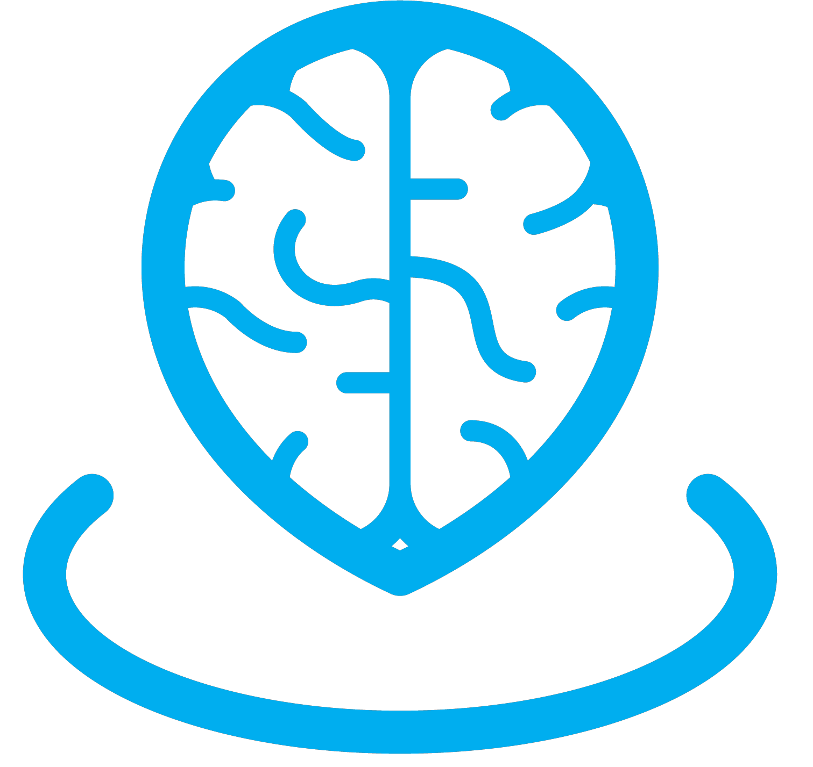

<h1 align="center"> Mind ; Land </h1> <br>
<p align="center">
  <a href="">
    
  </a>
</p>

<p align="center">
  Aplikasi web sebagai platform peduli terhadap kesehatan mental
</p>

<!-- START doctoc generated TOC please keep comment here to allow auto update -->
<!-- DON'T EDIT THIS SECTION, INSTEAD RE-RUN doctoc TO UPDATE -->

## Table of Contents

- [Introduction](#introduction)
- [Features](#features)
- [Feedback](#feedback)
- [Contributors](#contributors)
- [Build Process](#build-process)
- [Backers](#backers-)
- [Sponsors](#sponsors-)
- [Acknowledgments](#acknowledgments)

<!-- END doctoc generated TOC please keep comment here to allow auto update -->

## Introduction

Dengan bangga, kami persembahkan aplikasi ini sebagai platform peduli terhadap kesehatan mental, hasil dedikasi tim dalam Program MSIB x Dicoding Academy Batch 5. Selain memenuhi syarat lulus, aplikasi ini dihadirkan untuk memberikan kontribusi positif pada masyarakat. Terima kasih kepada Dicoding Academy dan Kampus Merdeka atas dukungan dan kesempatan yang diberikan, serta kepada rekan tim Capstone yang telah berkontribusi sepenuh hati. Semoga aplikasi ini dapat bermanfaat bagi banyak orang dalam menjaga dan meningkatkan kesehatan mental mereka.

## Features

Berikut beberapa fitur yang dapat kami tawarkan :

- Fitur Chat AI sebagai teman cerita
- Fitur Konsultasi bersama dokter psikolog
- Fitur Membaca artikel terkait kesehatan mental

### Built With

aplikasi ini dibangun menggunakan beberapa tech diantaranya adalah :

<ul>
  <li> </li>
  <li> </li>
  <li> </li>
  <li> </li>
  <li> </li>
  <li> </li>
</ul>

### Prerequisites

Sebelum dapat menjalankan aplikasi ini, kamu harus memasang beberapa hal dalam komputer kamu, diantaranya :

- npm
  ```sh
  npm install npm@latest -g
  ```

### Installation

Dibaawah ini adalah cara untuk memasang aplikasi ini dalam komputer kamu :

1. Clone the repo
   ```sh
   git clone https://github.com/Mind-Land/tailwind-migrate
   ```
2. Install NPM packages
   ```sh
   npm install
   ```
3. Enter your API in `config.js`
   ```js
   const API_KEY = "ENTER YOUR API";
   ```

<p align="right">(<a href="#readme-top">back to top</a>)</p>
